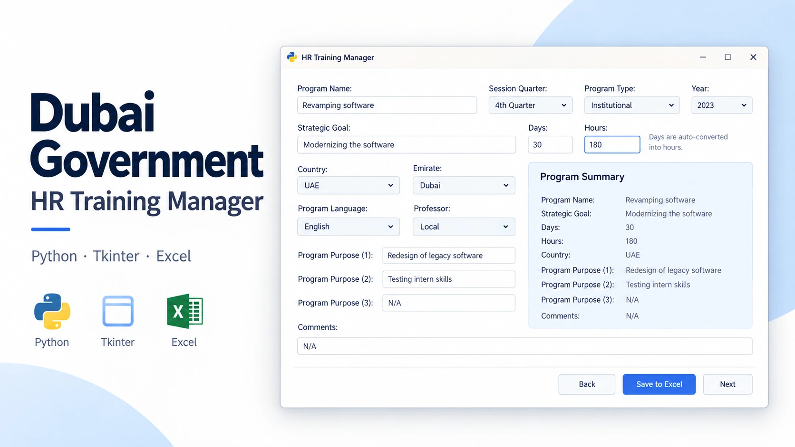
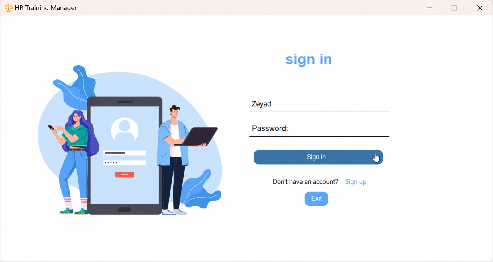
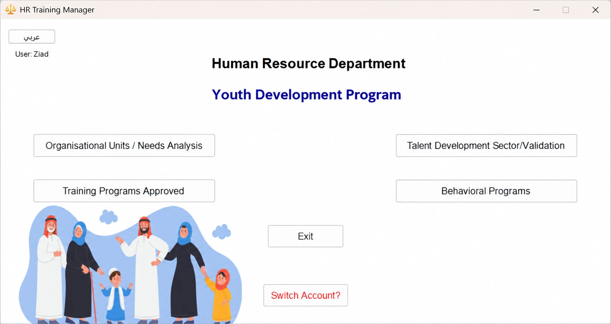
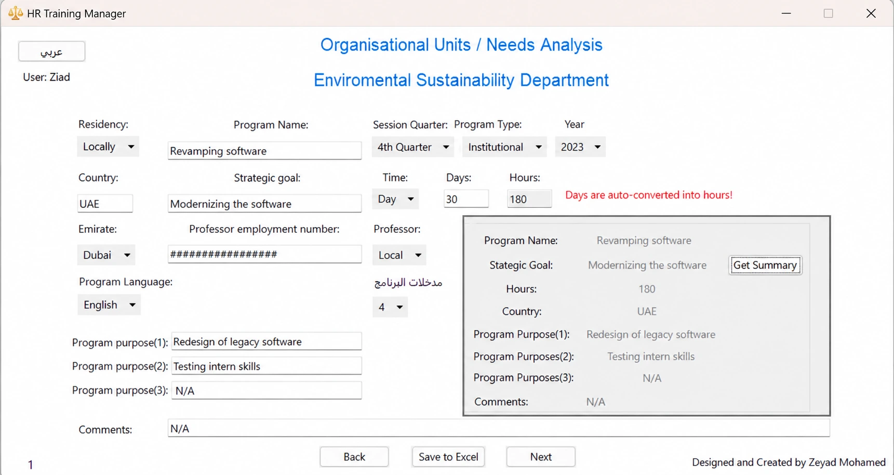
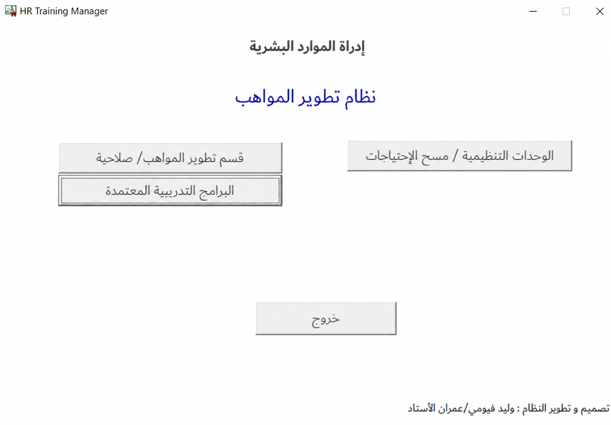
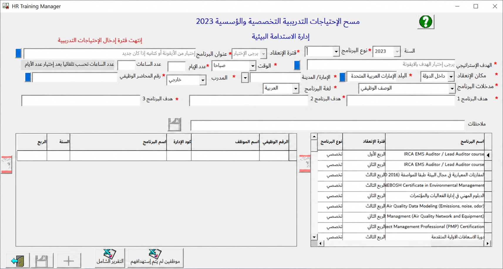
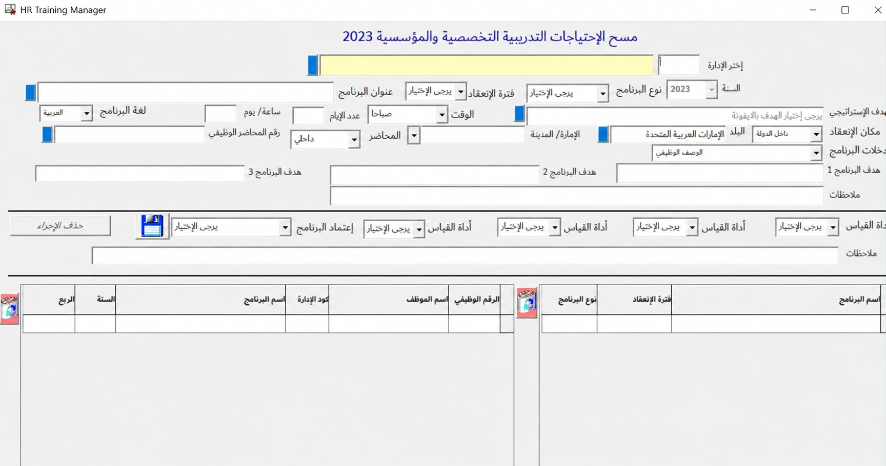

# HR Training Manager

A desktop application for Dubai Government built with Python and Tkinter (CustomTkinter). It features a login screen and data entry forms that save records to an Excel file (`program_data.xlsx`) on the user's Desktop.

> This project was developed as part of an internship. It was written entirely by hand, before the widespread use of AI coding tools. Every line of code was written manually, with help limited to Google searches and brainstorming. This was also my first-ever Python/coding project.

## Setup

```bash
pip install -r requirements.txt
```

Dependencies: `pandas`, `Pillow`, `customtkinter`, `openpyxl`, `matplotlib`, `fpdf`

## Running

```bash
python main.py
```

> **Note:** the login screen in the original code uses hardcoded credentials (`ziad` / `dubai`).

## Project cover



The cover is an AI-generated illustration of the application. Gallery images below were edited to remove former organizational branding; the application code remains the original hand-written project.

## Screenshots

### Application UI (branding removed)

| Login page | Home | First section |
|------------|------|---------------|
|  |  |  |

### Legacy UI (branding removed)

| 1 | 2 | 3 |
|---|---|---|
|  |  |  |

## Files

| File | Description |
|------|-------------|
| `main.py` | The main application (moved here from `pythonProject1/`). Login screen + data entry UI, exports data to `program_data.xlsx` on the Desktop. **Uses hardcoded absolute paths** (`C:\Users\ziadm\Desktop\DMX\...`) for images and icons, so it only runs on the original machine. |
| `DMX_working 2.py` | **The improved / portable version.** Same app, but resolves images relative to the script's own folder (`BASE_DIR`), so it runs anywhere. Also adds crash logging (`crash_log.txt`), import failure handling, and friendly error dialogs instead of silent crashes. Recommended version for running the app. |
| `DMX working.py` | An earlier draft of the same application. Like `main.py`, it uses hardcoded absolute paths. Kept as a reference to the earlier version. |
| `Room.py` | A separate standalone command-line tool (no GUI): an inventory tracker with add / update / remove / search operations and matplotlib visualizations. |

## Folder structure

- `assets/` — images and icon used by the app (`login.png`, `happy.png`, `scale.ico`)
- `docs/` — project documents (PDFs)
- `screenshots/` — screenshots of the app in use

## Important notes

- `main.py` and `DMX working.py` reference absolute paths (`C:\Users\ziadm\Desktop\DMX\...`) — they will not run on another machine without editing those paths.
- The app saves its output data as `program_data.xlsx` on the Desktop.
